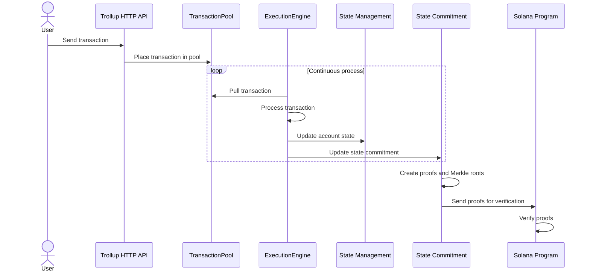

# trollup

This is my first attempt at creating a bare bones zk-rollup for Solana. There are a lot of ideas that are new to me,
so this is merely a representation of my attempt to learn about ZK, Merkle structures and transaction processing.

The basic idea that I'm playing around with in this example is a hybrid approach to ZK proof verification in Solana to reduce CU and cost.

### **Overview:**

- ZK proof verification happens off-chain, reducing CU.
- Only a commitment to the proof and its verification result is sent to Solana.
- The on-chain program performs a simpler verification of the commitment.
- This approach trades some decentralization for scalability, as it relies on off-chain verifiers.

Off-chain Verification - Complex ZK proof verification happens off-chain:

The verify_and_sign function handles this:

- verifies the ZK proof.
  - If the proof is valid, it creates a commitment containing the new state root and a timestamp.
  - The commitment is signed by a trusted verifier.

On-chain Commitment Verification:

- The Solana program receives a ZkProofCommitment instead of the full proof.
- The program checks the validity of the commitment (Not a robust implementation, just a basic example for learning). In the future maybe use a signature from a suite of trusted off-chain verifiers.

State Update:

- If the commitment is valid, the program updates the on-chain state (in this case, just updating a state root).

1. The user initiates the process by sending a transaction to Trollup's HTTP API.

2. The API receives the transaction and places it into the TransactionPool.

3. The ExecutionEngine continuously pulls transactions from the TransactionPool. This is represented by a loop in the diagram.

4. For each transaction, the ExecutionEngine:
   - Processes the transaction
   - Updates the account state in the State Management
   - Updates the state commitment

5. The State Management sends state changes to the State Commitment.

6. The State Commitment creates proofs and Merkle roots based on the state changes.

7. Finally, the proofs and Merkle roots are sent to the Solana program for verification.

8. The Solana program verifies the proofs.

### **Running this example**

1. Deploy the trollup-solana-programs to your local validator. You'll need to update state_commitment/state_commitment_layer.rs with your program ID
2. run example/main - This will create some example transactions, transaction pool and execution engine. It will then send the verification commitment to the on-chain program.

### **Future implementation ideas**

- Integrate with actual Solana SVM for processing transactions
- Use something like iggy.rs for the transaction pool. I like the idea of using an append log style event streamer to handle transactions and state changes across Trollup. It provides order and persistence.
- Use p2plib for Trollup clusters.
- Implement real ZK proofs and Merkle structs
- Configuration layer
- HTTP API
- More DB implementations
