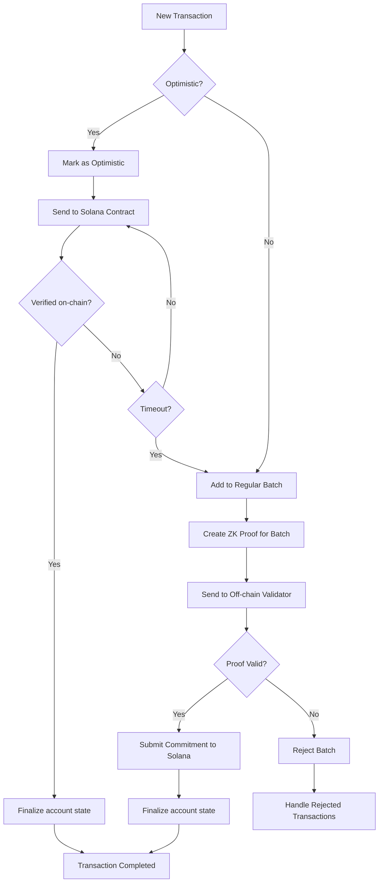
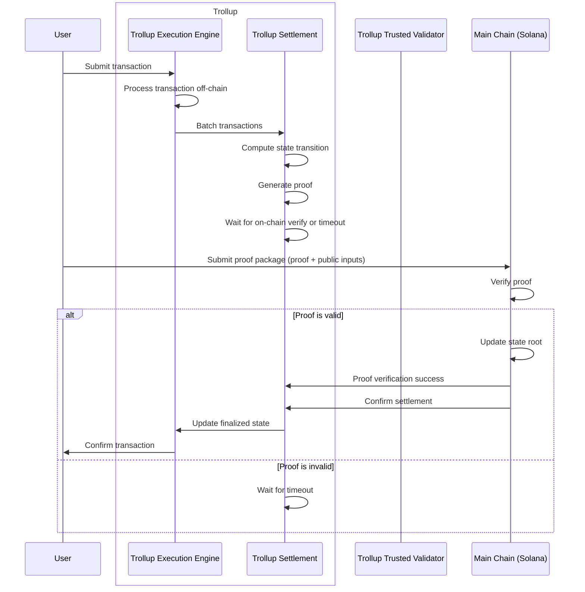
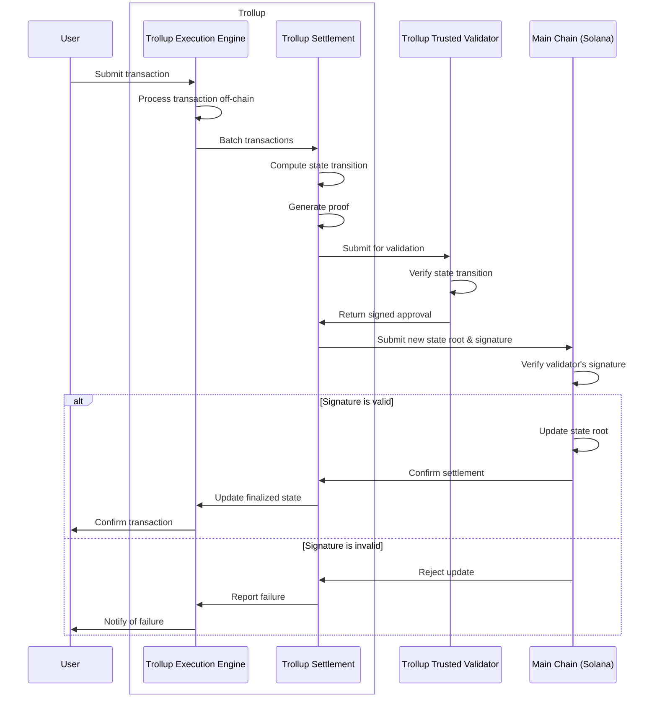

# Trollup - A Hybrid ZK-Optimistic Network Extension with Flexible Verification for Solana

[](https://github.com/wkennedy/trollup/actions/workflows/rust.yml)

### **Overview:**

The unique aspect of Trollup is its flexibility in handling transactions. It allows for quick finality through on-chain verification for optimistic transactions, while still maintaining the security of ZK proofs and the option for off-chain validation.
This approach could potentially offer benefits such as:

- Faster finality for certain transactions (the optimistic ones)
- Reduced on-chain load by allowing off-chain validation
- Strong security guarantees through ZK proofs
- Flexibility in transaction processing to balance speed and security

This approach aims at combining the strengths of different rollup types while mitigating their individual weaknesses.



Optimistic Sequence



Off-Chain Verification



### **Running this example**

With command line:

```shell
cargo build
```

```shell
cd api
cargo run
```

```shell
cd validator
cargo run
```

With Docker:

```shell
docker-compose -f docker-compose.yml
```

```shell
cd example
cargo run
```

After running the example you see output in the console for the Trollup API and Trollup Validator showing details of the flow. If everything runs successfully then you'll see the transactions on the Solana chain. See the links below for the programs.

[Proof Verify Program - Solana Explorer](https://explorer.solana.com/address/F68FK2Ai4vWVqFQpfx6RJjzpYieSzxWMqs179SBdcZVJ?cluster=devnet)

[Commitment Signature Verify Program - Solana Explorer](https://explorer.solana.com/address/7xyXvzfXcBhc8Tbv5gJp7j3XKzPaS3xEXGfwuDJ6MgAo?cluster=devnet)
