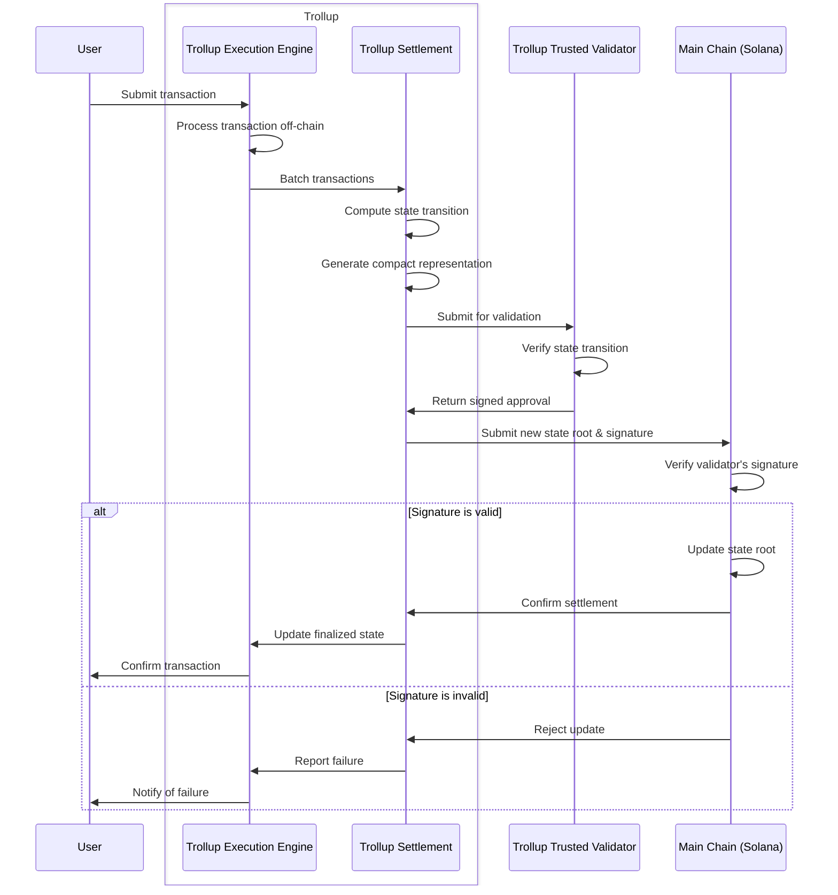

### **Future implementation ideas**

Eventually, the system will compose of two parts: Trollup and Trollup Validator.
Trollup handles most of the heavy lifting: transaction ingest, processing, state management and commmitment.
The Trollup Validator will simply verify the validity of the state change and return a signed commitment back to a Trollup server for finality.

A potential use case might be for organizations or groups that want to create a consortium and share resources, such
as a trusted network of validators.

- Integrate with actual Solana SVM for processing transactions
- Use something like iggy.rs for the transaction pool. I like the idea of using an append log style event streamer to handle transactions and state changes across Trollup. It provides order and persistence.
- Use p2plib for Trollup clusters.
- Implement real ZK proofs and Merkle structs
- Configuration layer
- HTTP API
- More DB implementations

