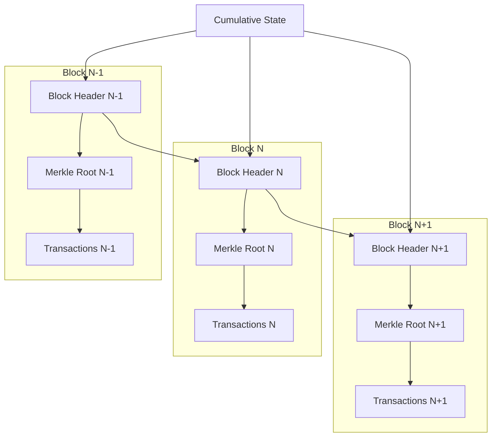

# Trollup State Commitment Library Documentation

## Overview

The Trollup State Commitment Library is a crucial component of the Trollup network extension, responsible for managing state commitments, pooling state changes, and interacting with validators for proof verification. This library integrates zero-knowledge proofs and Merkle trees for efficient state management and verification.

## Key Components

### 1. StateCommitment

The core struct that manages the state commitment process.

#### Key Methods:
- `new()`: Creates a new StateCommitment instance.
- `read_from_pool()`: Reads pending commitments from the pool.
- `verify_with_validator()`: Sends commitments to a validator for verification.
- `finalize()`: Finalizes a commitment after successful validation.
- `start_optimistic_commitment_processor()`: Manages optimistic transactions.

### 2. PdaListener

Listens for updates to a Program Derived Address (PDA) on the Solana blockchain.

#### Key Methods:
- `new()`: Creates a new PdaListener.
- `start()`: Starts the listening process with automatic reconnection.
- `connect_and_listen()`: Establishes a WebSocket connection and processes messages.

### 3. TreeComposite

Manages Merkle trees for state and transactions.

#### Key Methods:
- `new()`: Creates a new TreeComposite.
- `add_states()`: Adds account states to the state tree.
- `add_transactions()`: Adds transactions to the transaction tree.
- `get_root()` and `get_uncommitted_root()`: Retrieve the current and uncommitted roots.

### 4. StateCommitmentPool

A queue-like structure for managing pending state commitments.

#### Key Methods:
- `new()`: Creates a new StateCommitmentPool.
- `add()`: Adds a new commitment package to the pool.
- `get_next()`: Retrieves the next commitment package.
- `get_next_chunk()`: Retrieves a chunk of commitment packages.

### 5. ValidatorClient

Handles communication with the validator service.

`ValidatorClient` is responsible for communicating with the validator node, sending proofs for verification, and receiving responses.

## Key Processes

1. **State Commitment**:
   - Reads commitments from the pool.
   - For optimistic transactions, adds them to a separate queue.
   - For regular transactions, sends them to the validator for verification.

2. **Optimistic Transactions**:
   - Processed separately and faster.
   - If not verified on-chain within a timeout, they're processed through the regular flow.

3. **Validation**:
   - Proofs are generated and sent to an off-chain validator.
   - Validated state changes are then committed on-chain.

4. **Finalization**:
   - After successful validation, state changes are finalized.
   - New blocks are created and saved.

5. **PDA Listening**:
   - Continuously listens for updates to a specific PDA on Solana.
   - Uses WebSocket connection with automatic reconnection and ping/pong mechanism.

### State Commitment Process

1. The `StateCommitment` struct's `start` method initiates a loop that continually processes state changes.
2. State changes are read from the `StateCommitmentPool`.
3. For each package of changes:
    - Transactions are added to the transaction Merkle tree.
    - Account states are added to the state Merkle tree.
    - A zero-knowledge proof is generated for the state changes.
    - The proof is sent to the validator for verification using `ValidatorClient`.
    - If verified, the changes are committed to the respective state managers and a new block is created.

### Merkle Tree Management

The library uses `rs_merkle` to manage Merkle trees for both state and transactions, allowing for efficient verification of state changes.

## Customization

The library uses generic types extensively, allowing for customization of the exact state records and management systems used. Implement the required traits (`StateRecord`, `ManageState`, etc.) to adapt the library to your specific needs.

## Conclusion

The Trollup State Commitment Library provides a robust framework for managing state changes in the Trollup network extension. It combines efficient data structures (Merkle trees) with zero-knowledge proofs to ensure the integrity and privacy of state transitions, while providing a flexible interface for integration with other components of the blockchain system.

TODO

